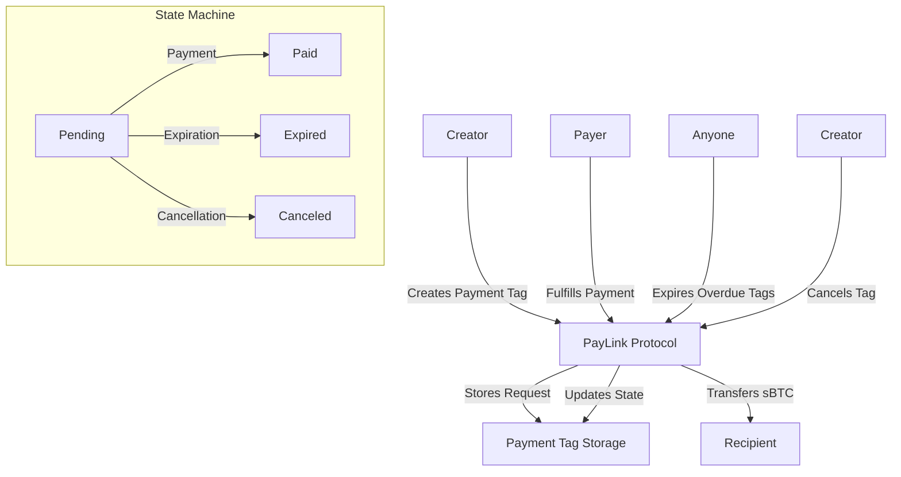

# PayLink Protocol

> **Revolutionary payment infrastructure that transforms how digital transactions are initiated, managed, and executed in the Web3 ecosystem.**

[](https://clarity-lang.org/)
[](https://stacks.co/)
[](LICENSE)

## Overview

PayLink Protocol introduces a sophisticated payment request framework built on Stacks blockchain, enabling seamless sBTC-powered transactions with enterprise-grade reliability. The protocol supports dynamic payment orchestration, automated state transitions, and comprehensive audit trails.

### Key Features

- 🔗 **Intelligent Payment Links**: Create programmable payment requests with advanced lifecycle management
- ⏰ **Time-bound Execution**: Automated expiration handling with customizable timeframes
- 🔒 **Security First**: Comprehensive validation, fraud prevention, and authorization controls
- 📊 **Real-time Monitoring**: Event streaming and state tracking for payment monitoring
- 🚀 **High Performance**: Advanced indexing for efficient querying and batch operations
- 💰 **sBTC Integration**: Native support for Bitcoin-backed transactions on Stacks

## System Overview

PayLink Protocol operates as a trustless payment request engine that facilitates secure, time-bound transactions between parties. The system manages the complete lifecycle of payment requests from creation to settlement or expiration.



## Contract Architecture

### Core Components

#### 1. **Payment Tag System**

- **Primary Storage**: `payment-tags` map stores complete payment request data
- **Indexing**: Separate creator and recipient indexes for efficient querying
- **State Management**: Automated state transitions (pending → paid/expired/canceled)

#### 2. **Data Structures**

```clarity
;; Core payment tag structure
{
  creator: principal,        ;; Payment request creator
  recipient: principal,      ;; Intended payment recipient
  amount: uint,             ;; Payment amount in sBTC satoshis
  created-at: uint,         ;; Creation block height
  expires-at: uint,         ;; Expiration block height
  memo: (optional string),  ;; Optional payment description
  state: string,           ;; Current state (pending/paid/expired/canceled)
  payment-tx: (optional buff), ;; Transaction hash when paid
  payment-block: (optional uint), ;; Block height when paid
}
```

#### 3. **State Constants**

- `STATE-PENDING`: Initial state for new payment requests
- `STATE-PAID`: Successfully fulfilled payment
- `STATE-EXPIRED`: Expired unfulfilled payment
- `STATE-CANCELED`: Creator-canceled payment

### Security Model

#### Access Controls

- **Creator Privileges**: Can cancel their own pending tags
- **Universal Access**: Anyone can fulfill or expire tags
- **Admin Functions**: Contract deployer can pause/unpause operations

#### Validation Rules

- Minimum payment amount: 0.00001 sBTC (prevents spam)
- Maximum expiration: 30 days (~4320 blocks)
- Self-payment prevention
- Contract pause mechanism for emergencies

## Data Flow

### 1. Payment Tag Creation

```text
Creator → create-payment-tag() → Validation → Storage → Index Updates → Event Emission
```

### 2. Payment Fulfillment

```text
Payer → fulfill-payment-tag() → Validation → sBTC Transfer → State Update → Event Emission
```

### 3. Tag Expiration

```text
Anyone → expire-payment-tag() → Validation → State Update → Event Emission
```

### 4. Tag Cancellation

```text
Creator → cancel-payment-tag() → Authorization → State Update → Event Emission
```

## API Reference

### Public Functions

#### `create-payment-tag`

Creates a new payment request.

```clarity
(create-payment-tag 
  recipient         ;; principal - Payment recipient
  amount           ;; uint - Amount in sBTC satoshis
  expires-in-blocks ;; uint - Blocks until expiration
  memo             ;; (optional string) - Payment description
)
```

**Returns**: `(response uint uint)` - New tag ID or error code

#### `fulfill-payment-tag`

Fulfills an existing payment request.

```clarity
(fulfill-payment-tag tag-id) ;; uint - Payment tag ID
```

**Returns**: `(response uint uint)` - Tag ID or error code

#### `cancel-payment-tag`

Cancels a pending payment request (creator only).

```clarity
(cancel-payment-tag tag-id) ;; uint - Payment tag ID
```

**Returns**: `(response uint uint)` - Tag ID or error code

#### `expire-payment-tag`

Marks an overdue payment request as expired.

```clarity
(expire-payment-tag tag-id) ;; uint - Payment tag ID
```

**Returns**: `(response uint uint)` - Tag ID or error code

### Read-Only Functions

#### `get-payment-tag`

Retrieves complete payment tag data.

```clarity
(get-payment-tag tag-id) ;; uint
```

#### `get-creator-tags`

Gets all tag IDs created by a specific user.

```clarity
(get-creator-tags creator) ;; principal
```

#### `get-recipient-tags`

Gets all tag IDs where user is the recipient.

```clarity
(get-recipient-tags recipient) ;; principal
```

#### `can-expire-tag`

Checks if a tag can be expired.

```clarity
(can-expire-tag tag-id) ;; uint
```

#### `get-contract-stats`

Retrieves contract usage statistics.

```clarity
(get-contract-stats stat-key) ;; string-ascii
```

## Error Codes

| Code | Constant | Description |
|------|----------|-------------|
| 100 | `ERR-TAG-EXISTS` | Tag already exists |
| 101 | `ERR-NOT-PENDING` | Tag is not in pending state |
| 102 | `ERR-INSUFFICIENT-FUNDS` | Insufficient balance |
| 103 | `ERR-NOT-FOUND` | Tag not found |
| 104 | `ERR-UNAUTHORIZED` | Unauthorized operation |
| 105 | `ERR-EXPIRED` | Tag has expired |
| 106 | `ERR-INVALID-AMOUNT` | Invalid amount specified |
| 107 | `ERR-EMPTY-MEMO` | Empty memo provided |
| 108 | `ERR-MAX-EXPIRATION-EXCEEDED` | Expiration too far in future |
| 109 | `ERR-INVALID-RECIPIENT` | Invalid recipient address |
| 110 | `ERR-SELF-PAYMENT` | Cannot create payment to self |

## Events

The contract emits structured events for all major operations:

- `payment-tag-created`: New payment request created
- `payment-tag-fulfilled`: Payment successfully completed
- `payment-tag-canceled`: Payment request canceled
- `payment-tag-expired`: Payment request expired
- `contract-pause-toggled`: Contract pause state changed

## Development Setup

### Prerequisites

- [Clarinet](https://github.com/hirosystems/clarinet) for Clarity development
- [Node.js](https://nodejs.org/) for running tests
- [Stacks CLI](https://docs.stacks.co/stacks-cli) for deployment

### Installation

```bash
# Clone the repository
git clone https://github.com/princess-ayo/paylink.git
cd paylink

# Install dependencies
npm install

# Check contract syntax
clarinet check

# Run tests
npm test
```

### Testing

The project includes comprehensive test coverage:

```bash
# Run all tests
npm test

# Run tests with coverage report
npm run test:report

# Watch mode for development
npm run test:watch
```

### Deployment

1. **Testnet Deployment**:

   ```bash
   clarinet integrate
   ```

2. **Mainnet Deployment**:
   - Update sBTC contract address in `contracts/paylink.clar`
   - Deploy using Clarinet or Stacks CLI

## Use Cases

### E-commerce Platforms

- Invoice generation with automatic expiration
- Subscription payment requests
- Marketplace transaction facilitation

### DeFi Applications

- Loan payment requests
- Yield farming reward claims
- Multi-party settlement coordination

### Service Businesses

- Professional service billing
- Recurring payment automation
- Client payment tracking

### Enterprise Solutions

- Inter-company transfers
- Vendor payment processing
- Audit trail maintenance

## Security Considerations

- **Smart Contract Audits**: Recommended before mainnet deployment
- **sBTC Integration**: Ensure proper token contract validation
- **Expiration Management**: Monitor and expire overdue tags
- **Access Controls**: Implement proper frontend authorization

## Roadmap

- [ ] Multi-token support beyond sBTC
- [ ] Batch payment operations
- [ ] Payment splitting functionality
- [ ] Integration with payment gateways
- [ ] Mobile SDK development
- [ ] Advanced analytics dashboard

## Contributing

1. Fork the repository
2. Create your feature branch (`git checkout -b feature/amazing-feature`)
3. Commit your changes (`git commit -m 'Add some amazing feature'`)
4. Push to the branch (`git push origin feature/amazing-feature`)
5. Open a Pull Request

## License

This project is licensed under the ISC License - see the [LICENSE](LICENSE) file for details.

---

Built with ❤️ on Stacks blockchain